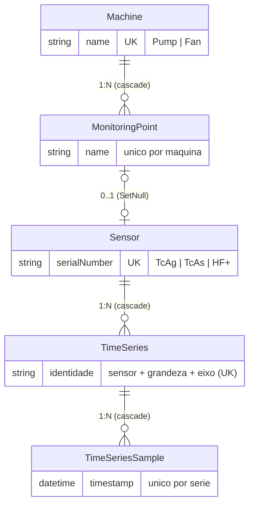

# Dynamox Full-Stack Challenge — Monitoramento de Ativos

Solução completa para o [Dynamox Full-Stack Developer Challenge](./full-stack-challenge.md):
uma aplicação de monitoramento de condição de ativos industriais com autenticação JWT,
gestão de máquinas, pontos de monitoramento e sensores, e ingestão/consulta de séries
temporais — frontend React integrado de ponta a ponta a uma API NestJS com PostgreSQL.

> Os dados são **sintéticos e didáticos**. A aplicação nunca acessa a plataforma
> produtiva da Dynamox; o frontend recusa por código qualquer URL de API apontando para
> `dynamox.solutions` ou `dynamox.net`.

## Arquitetura

| Camada | Tecnologia | Papel |
|---|---|---|
| Frontend | React 18 + TypeScript + Vite 5 | SPA com rotas protegidas e shell Material Design |
| Estado global | Redux Toolkit + Redux Thunk | slices por domínio, efeitos assíncronos nos thunks |
| UI | Material UI 5 | sidenav responsivo, tabelas ordenáveis/paginadas, formulários |
| Gráficos | Recharts | visualização da série temporal |
| Backend | NestJS 10 (Node.js) | API REST com guard JWT global e validação rígida |
| ORM | Prisma 5 | migrações versionadas, transações e locks |
| Banco | PostgreSQL 16 (Docker Compose) | persistência, índices únicos como autoridade final |
| Monorepo | Nx 20 sobre npm workspaces | grafo de build `libs → api → web`, cache de alvos |
| Contratos | JSON Schema + Ajv | contrato de telemetria como fonte única de verdade |

A regra central de arquitetura: **o backend é a autoridade**. Toda validação relevante
(unicidade, regra Pump × sensores, contratos de payload) é aplicada e testada na API e no
banco; o frontend apenas antecipa mensagens e espelha o estado.

## Estrutura do monorepo

```
apps/api          backend NestJS (auth, máquinas, pontos/sensores, telemetria, health)
apps/web          frontend React + Vite + MUI 5 + Redux Toolkit
libs/domain       vocabulário e regras de domínio (isomórfico, sem dependência de Node)
libs/contracts    validação Ajv do contrato de telemetria e utilitários determinísticos
libs/ui           estados reutilizáveis de carregamento, erro e vazio
contracts/dynamox snapshot da API pública Dynamox + contrato interno + exemplo
prisma            schema, migrações e seed idempotente
docs              SETUP detalhado e análises técnicas
tools             validação de contratos e utilitários de linha de comando
```

## Como executar

Pré-requisitos: **Node.js 20+** (validado com 22), **npm 10** e **Docker com Compose v2**.

```bash
cp .env.example .env          # OBRIGATÓRIO: sem .env a API não sobe (falta JWT_SECRET)
npm install
npm run db:up                 # PostgreSQL 16 em container (porta 5433, para não colidir com um 5432 local)
npm run prisma:deploy         # aplica as migrações versionadas
npm run seed                  # usuário fixo + máquina P-101 com 2 pontos, sensores e série de demonstração
```

Em dois terminais:

```bash
npm run dev:api               # API em http://localhost:3000/api
npm run dev:web               # web em http://localhost:5173
```

Todas as variáveis têm padrão local documentado no próprio [`.env.example`](./.env.example)
(porta do banco, segredo do JWT, credencial do seed). Nenhum segredo real é versionado.

### Credenciais de demonstração

| Campo | Valor |
|---|---|
| E-mail | `analista@dynamox.local` |
| Senha | `Dynamox@2026` |

O seed grava a senha como `scrypt$salt$hash` (nunca em texto puro) e redefine o hash a
cada execução, então a credencial anunciada sempre funciona.

### Fluxo principal de uso

1. **Login** em `http://localhost:5173` com a credencial acima — rotas privadas são
   inacessíveis sem sessão, e **Sair** encerra a sessão.
2. **Visão geral**: estado da API/banco e o gráfico da série temporal do seed.
3. **Máquinas**: criar (nome + tipo `Pump`/`Fan`), editar e excluir, com os erros reais
   da API exibidos (nome duplicado, regra de sensores ao virar Pump).
4. **Pontos e sensores**: criar pontos para uma máquina, associar sensor
   (`TcAg`/`TcAs`/`HF+`, modelos proibidos desabilitados para Pump) e navegar na tabela
   paginada de 5 em 5, ordenável por qualquer coluna nos dois sentidos.
5. **Swagger** (atalho no menu lateral): ingestão de um novo ciclo de telemetria e
   demais operações, autenticando pelo botão **Authorize**.

### Documentação interativa da API

Swagger UI em <http://localhost:3000/api/docs> (documento OpenAPI 3 em `/api/docs-json`),
com todas as rotas e códigos de erro, e os schemas dos corpos de requisição; os formatos
de resposta estão descritos em cada operação e em [`docs/SETUP.md`](./docs/SETUP.md). As
rotas privadas exigem
`Authorization: Bearer <token>`; pelo terminal:

```bash
TOKEN=$(curl -s -X POST http://localhost:3000/api/auth/login \
  -H 'Content-Type: application/json' \
  -d '{"email":"analista@dynamox.local","password":"Dynamox@2026"}' \
  | python3 -c 'import json,sys; print(json.load(sys.stdin)["token"])')

curl -s http://localhost:3000/api/machines -H "Authorization: Bearer $TOKEN"
```

### Verificações

```bash
npm run lint                  # ESLint nos 5 projetos, zero warnings tolerados
npm run typecheck             # tsc estrito em todos os projetos
npm run test                  # suítes API (Jest, contra PostgreSQL real) + web (Vitest)
npm run build                 # Nx: libs -> api -> web
npm run contracts:validate    # SCP-04: sintaxe, hash do snapshot público, exemplo × schema
```

## Modelo de domínio



Regras importantes, aplicadas na API **e** garantidas por índices/constraints no banco:

- **Modelos de sensor**: exclusivamente `TcAg`, `TcAs` e `HF+` (vocabulário público nas
  respostas; o enum interno do banco nunca vaza).
- **Um sensor por ponto** (índice único no vínculo) e **identificador de sensor único
  global** (`serialNumber`).
- **Restrição Pump**: máquinas `Pump` recusam `TcAg`/`TcAs` na associação **e** na troca
  de tipo — um `PATCH` que tornaria a máquina Pump com sensor proibido é revertido
  transacionalmente. Os dois fluxos são serializados por lock na linha da máquina
  (`SELECT … FOR UPDATE`), então a regra vale mesmo sob requisições concorrentes — há
  teste e2e disparando as duas operações em paralelo.
- **Cascatas**: excluir uma máquina remove seus pontos (cascade); o sensor é apenas
  desassociado (SetNull), pois representa um ativo físico reutilizável. Excluir uma
  série remove todas as suas amostras.
- **Séries**: identidade única por (sensor, grandeza física, eixo); grandezas escalares
  usam o eixo sentinela `NONE` em vez de NULL (NULLs são distintos entre si no
  PostgreSQL e furariam a unicidade).

## Telemetria (séries temporais)

- **Ingestão** (`POST /api/telemetry-cycles`): payload validado por JSON Schema
  ([contrato interno](./contracts/dynamox/telemetry-cycle.schema.json) derivado do
  snapshot público da Dynamox, com `additionalProperties: false`), timestamps canônicos
  UTC com milissegundos.
- **Idempotência em duas camadas**: header `Idempotency-Key` (a intenção do cliente) +
  fingerprint SHA-256 canônico do conteúdo. Repetir o mesmo ciclo devolve `200
  duplicate: true` sem gravar nada; reutilizar uma chave com conteúdo diferente é `409`.
  Sob corrida, o índice único do banco decide e a perdedora devolve o resultado da
  vencedora. Conflitos abortam a transação inteira — nunca há gravação parcial.
- **Leitura completa e paginada** (`GET /api/time-series/:id/samples?limit=&offset=`):
  resposta `{ items, total, limit, offset }` com página e contagem no mesmo snapshot
  (Repeatable Read) — a série inteira é recuperável, nada é truncado em silêncio.
- **Contagem**: `GET /api/time-series` lista todas as séries armazenadas (a contagem é o
  tamanho da lista) com `sampleCount` por série; `/metrics` traz `count`, mínimo,
  máximo, média, último valor e a janela temporal.
- **Exclusão** (`DELETE /api/time-series/:id`): remove série e amostras em cascata,
  preservando o registro de auditoria da ingestão.
- **Visualização**: gráfico Recharts na Visão geral, alimentado pela API autenticada.

## Pressupostos e ambiguidades documentados

O enunciado pede que ambiguidades sejam resolvidas com pressupostos explícitos:

1. **Credencial fixa** = usuário criado pelo seed (configurável por env), não credencial
   hard-coded no frontend. O JWT é emitido e validado pela própria API.
2. **Sessão**: token em `sessionStorage` (sobrevive a reload, morre ao fechar o
   navegador), validade de 8h, sem refresh token — simplicidade adequada ao escopo.
3. **Unicidade**: nome de máquina é único global; nome de ponto é único **por máquina**;
   ambos com trim e limite de 120 caracteres. O teto é uma decisão defensiva de produto:
   como os nomes participam de índices únicos, aceitar tamanho arbitrário empurraria ao
   banco uma falha que deveria ser validação (um nome de ~10 KB estoura a entrada do
   índice B-tree e viraria 500; testado no e2e) — a API responde 400 determinístico.
4. **"Pelo menos dois pontos de monitoramento"**: demonstrado pelo seed (P-101 com dois
   mancais, cada um com sensor HF+) e suportado sem limite pela API/UI.
5. **Paginação de 5**: a interface usa sempre 5 por página, como pede o enunciado; na
   API o `pageSize` é parâmetro opcional (padrão 5, máx. 50) para testes e consumidores
   programáticos.
6. **Ordenação por qualquer coluna**: server-side, pelo **vocabulário público** exibido
   na tabela (ex.: `HF+` < `TcAg` < `TcAs` alfabeticamente), pontos sem sensor sempre ao
   final e desempate determinístico — e não pela ordem interna dos enums do banco.
7. **"Number of time-series stored"**: interpretado como a listagem completa de séries
   (contagem = tamanho) somada ao `sampleCount`/`metrics.count` por série.
8. **Formato de ingestão**: em vez de um formato inventado, o payload segue um contrato
   reduzido derivado do OpenAPI público da Dynamox (`POST /v1/telemetry-cycles`),
   congelado e auditado em [`contracts/dynamox/`](./contracts/dynamox/README.md) — a
   chave de idempotência viaja em header porque `additionalProperties: false` proíbe
   campos extras no corpo.
9. **Contratos rígidos**: propriedades desconhecidas em corpo **e** query string são
   rejeitadas com 400 (nunca ignoradas em silêncio), com códigos de erro estáveis
   documentados no Swagger.

## Decisões e trade-offs

- **Nx sobre npm workspaces (package-based)**: cada projeto é um pacote npm executável
  isoladamente; o Nx orquestra `build/lint/typecheck/test` com `dependsOn: ["^build"]`,
  sem acoplamento a geradores de plugin.
- **DTOs parseados à mão** em vez de class-validator: rejeição de chaves desconhecidas,
  mensagens com código estável e zero dependência de metadados de decorators; no fluxo
  de telemetria, o JSON Schema (Ajv) é a fonte única de verdade.
- **Testes de API contra PostgreSQL real** (Jest e2e) para os invariantes que dependem
  do banco (unicidade, locks, transações, cascatas), complementados por testes unitários
  isolados das regras de serviço e por testes de componente no frontend (Vitest +
  Testing Library).
- **`@nestjs/jwt` v10**: a v12 é ESM-only e incompatível com a cadeia Jest/CJS atual.
- **Porta 5433** para o PostgreSQL do projeto, evitando colisão com instalações locais.
- **Tema Material** com sidenav colapsável, toolbar em card e ações em pílula — tokens
  de design emprestados de um design system interno, sem reprodução de marca.

## Limitações conhecidas

- Sem refresh token: a sessão dura exatamente a validade do JWT (8h por padrão).
- Usuário único de demonstração; não há gestão de múltiplos usuários nem papéis (o
  enunciado pede credencial fixa).
- Sem testes e2e de navegador (Cypress) — os fluxos são cobertos por testes de
  componente e a validação em navegador real foi manual.
- Bônus não implementados: deploy público, previsão de séries, load balancer e load
  tests.
- O gráfico exibe a primeira página de amostras (até 500 pontos); a API entrega a série
  completa por paginação.

## Latência (< 350 ms)

O requisito do enunciado — *"the latency between client and the server side should be
below 350ms for all requests"* — tem verificação reproduzível:

```bash
npm run dev:api               # terminal 1: API no ar
npm run perf:latency          # terminal 2: mede e dá o veredito
```

O script ([`tools/measure-latency.ts`](./tools/measure-latency.ts)) autentica de verdade,
descarta 5 requisições de aquecimento por rota, mede 30 amostras sequenciais em 9 rotas
(login, health, listagens, série/amostras/métricas e um par escrita/exclusão que limpa os
próprios dados) e **reprova se o máximo observado de qualquer rota atingir 350 ms** —
"all requests", leitura estrita. Resultado observado em ambiente local
(node v22, linux x64, Intel i5-13420H):

| rota | média | p95 | max |
|---|---|---|---|
| POST /auth/login | 33,9 ms | 35,4 ms | 35,7 ms |
| GET /health | 3,5 ms | 4,7 ms | 4,9 ms |
| GET /machines | 4,1 ms | 4,9 ms | 5,3 ms |
| GET /monitoring-points | 4,3 ms | 5,0 ms | 5,2 ms |
| GET /time-series | 4,0 ms | 4,7 ms | 4,8 ms |
| GET /time-series/:id/samples (500 pts) | 5,4 ms | 7,2 ms | 7,4 ms |
| GET /time-series/:id/metrics | 6,0 ms | 6,6 ms | 7,1 ms |
| POST /machines | 5,1 ms | 6,0 ms | 6,1 ms |
| DELETE /machines/:id | 4,2 ms | 5,2 ms | 5,3 ms |

Pior caso: o login (~34 ms), dominado pelo custo **intencional** do scrypt na verificação
de senha — ainda uma ordem de grandeza abaixo do limite.

## Testes

```bash
npm run test                        # tudo: API + web
npm run test -w @dynamox/api        # Jest: unitários + e2e (PostgreSQL real) + contrato
npm run test:unit -w @dynamox/api   # somente unitários isolados (mocks, sem banco, < 2 s)
npm run test -w @dynamox/web        # Vitest: componentes, slices Redux e cliente HTTP
```

Os **unitários isolados** cobrem as regras de negócio sem infraestrutura: parsers de
corpo e query (contratos rígidos), regra Pump × TcAg/TcAs na associação e na troca de
tipo, tradução dos erros do banco em códigos HTTP estáveis, bijeção do vocabulário
público ↔ enums internos e o envelope de paginação de amostras.

As suítes de API exigem o PostgreSQL do compose no ar (`npm run db:up`). Os testes e2e
criam e removem as próprias fixtures (prefixos dedicados) e não destroem o seed. Entre os
casos estão: corrida `PATCH → Pump` × associação de `TcAg` em paralelo, idempotência de
ingestão sob repetição, paginação varrendo a série inteira e ordenação nas quatro colunas
nos dois sentidos.

## Documentação adicional

- [`docs/SETUP.md`](./docs/SETUP.md) — guia operacional detalhado (variáveis, rotas,
  convenções por módulo e códigos de erro).
- [`contracts/dynamox/README.md`](./contracts/dynamox/README.md) — proveniência do
  snapshot público, hash e inconsistências documentadas da spec.
- [`docs/analysis/`](./docs/analysis/README.md) — análises técnicas (arquitetura de
  autenticação, mapeamento sensor × API, drift de contrato, inventário de endpoints).
- [`full-stack-challenge.md`](./full-stack-challenge.md) — enunciado original preservado.
